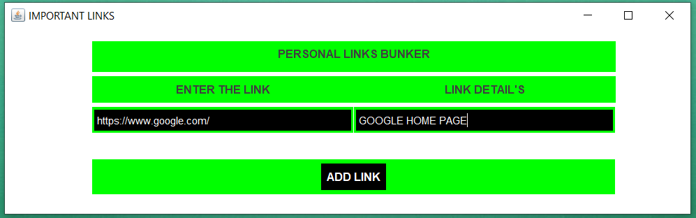
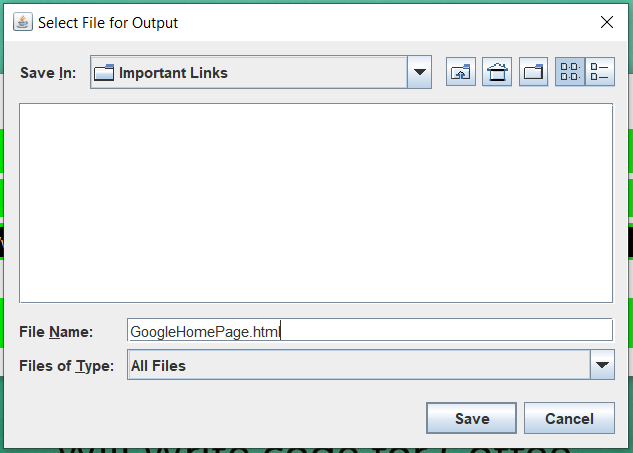
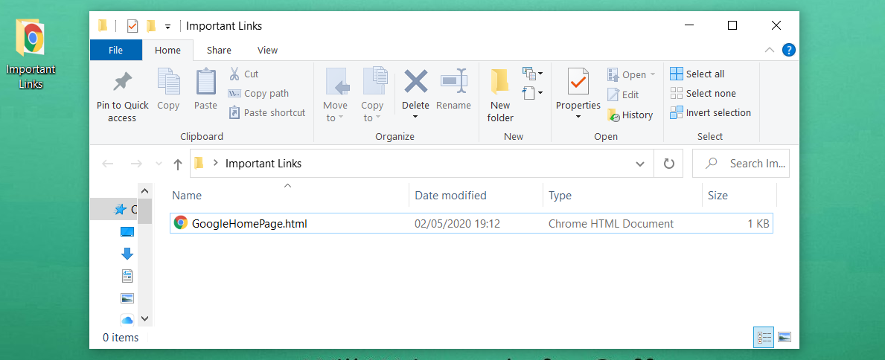
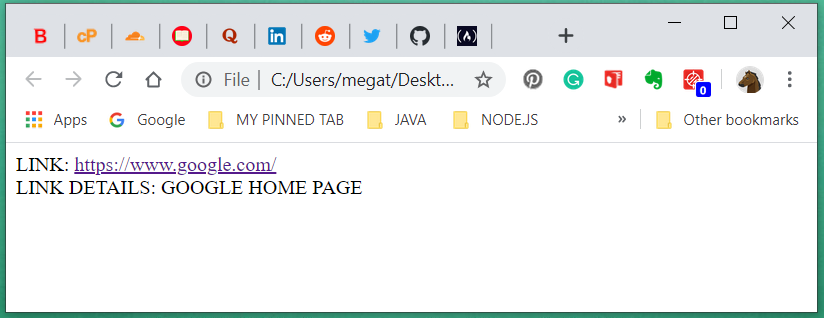

# Private-Links-Bookmarks

This is a small program for creating a personal bookmark links and save them into your desired folder it could be into your computer or
into a portable disk in case you travel and you don't have the laptop whit you but you need to access important links for your work.

<h3>How it wroks</h3>

- Create a folder on your laptop desired location or portable disk. This folder it will be used to save all the links you want to be marked
as important.
- Name the folder as you wish for example Important Links.
- Open the program and introduce the link in the left input field and the description of that link in the right input field.

<h3>Example</h3>: 

<h3>Click the Add button</h3>.

- A new dialog will open, navigate and select the folder you have been created above, in this case, Important Links, select it and then in
the <strong>File Name</strong> input field type the name of the file for example if the link is about a website type the domain name of the
website or if the the link is about your Facebook account type My Facebook Account and so on for each link you will save in this folder.

- <strong>It is very important</strong> after you typed the name of the link you must add dot ( .html ) to make that file an HTML file and
then click save.

<h3>Example</h3>: 

- Open the folder where you saved the file and you will see a html file.
- Click on it to open that file in the browser and you will see the link you have saved plus the description of the link.
- Click on the blue link to open it in tha browser. 
- That is it, you are done.

<h3>Example of the Html file saved in the Important Links folder created above</h3>: 
 

<h3>Example of the link and description of the link saved in the Html file</h3>: 

